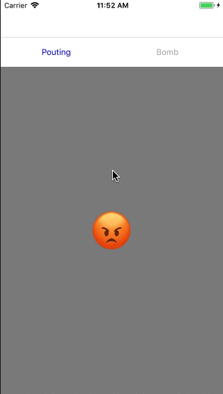

# Pager

> Easy to use wrapper of UIPagerViewController

## Requirements

- iOS 9.0+
- Xcode 9.2

## Installation

#### CocoaPods
You can use [CocoaPods](http://cocoapods.org/) to install `Pager` by adding it to your `Podfile`:

```ruby

platform :ios, '9.0'
use_frameworks!

target 'YourTarget' do
    pod "Pager", :git => "https://bitbucket.org/funamboleng/ios-pager"
end

```

To get the full benefits import `Pager`

``` swift
import Pager
```

## Usage example

set up your `PagerAppearance`

```swift
let appearence = PagerAppearance(   type: PagerType.fixedNumber(2),
                                    titleColors: [(.blue, .selected), (.blue, .highlighted), (.lightGray, .normal)] )
```

for the different customization options  take a look at  `PagerAppearance` init

```swift
public init(type: PagerType,
            selected: Int = 0,
            height: CGFloat = 50.0,
            color: UIColor? = .clear,
            titleColors: [(UIColor, UIControlState)]? = [(.black, .normal)],
            font: UIFont = UIFont.systemFont(ofSize: UIFont.systemFontSize) ) {
            ...
```

define your viewControllers

```swift

let PoutingVC: BeautifulViewController = {  let vc = BeautifulViewController(text: "😡")
                                            vc.view.backgroundColor = UIColor.gray
                                            return vc
                                            }()
let BombVC: BeautifulViewController    = { let vc = BeautifulViewController(text: "💣")
                                            vc.view.backgroundColor = UIColor.lightGray
                                            return vc
                                            }()
let NerdVC: BeautifulViewController    = {  let vc = BeautifulViewController(text: "🤓")
                                            vc.view.backgroundColor = UIColor.white
                                            return vc
                                            }()
let SkullVC: BeautifulViewController   = {  let vc = BeautifulViewController(text: "☠️")
                                            vc.view.backgroundColor = UIColor.green
                                            return vc
                                            }()
```

set up the  `PagerPage` array

```swift
let viewControllers: [PagerPage] = [( PoutingVC , "Pouting"),
                                    ( BombVC , "Bomb"),
                                    ( NerdVC , "Nerd"),
                                    ( SkullVC , "Skull") ]
```

init your `Pager`

```swift
let pager = Pager( viewControllers , appearence:  appearence )
```
add it to your view

```swift
self.add(childController: pager, toView: self.view)
```

## Example Preview


